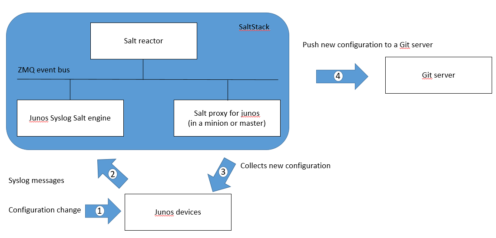
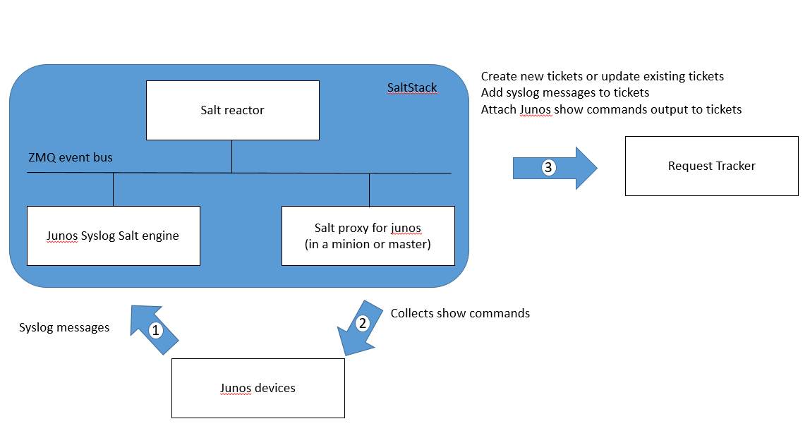

# About this project

Labs guide for automation summit July 2018. 

# About the labs

## Building blocks:  
- Junos devices
- Ubuntu VMs
- SaltStack
- Docker
- Gitlab
- RT (Request Tracker)

##  Automated Junos configuration backup on Git

At each junos commit, SaltStack automatically collects the new junos configuration file and archives it to a git server: 
- When a Junos commit is completed, the Junos device send a syslog message ```UI_COMMIT_COMPLETED```.  
- The junos devices are configured to send this syslog message to SaltStack.  
- Each time SaltStack receives this syslog message, SaltStack automatically collects the new junos configuration file from the
JUNOS device that send this commit syslog message, and SaltStack automatically archives the new junos configuration file to a git server  

  

## Automated tickets management

Junos automation demo using SaltStack and a ticketing system (Request Tracker):  
- Junos devices send syslog messages to SaltStack.  
- Based on syslog messages received from junos devices: 
  - SaltStack automatically creates a new RT (Request Tracker) ticket to track this issue. If there is already an existing ticket to track this issue, SaltStack updates the existing ticket instead of creating a new one. The syslog messages are added to the appropriate tickets.  
  - SaltStack automatically collects "show commands" output from junos devices and attach the devices output to the appropriate tickets. 

  

# Labs instructions

## Ubuntu

We will install the labs components (docker, SaltStack ....) on Ubuntu VMs 
```
$ uname -a
Linux ubuntu 4.4.0-87-generic #110-Ubuntu SMP Tue Jul 18 12:55:35 UTC 2017 x86_64 x86_64 x86_64 GNU/Linux
```

## Install Docker

Check if Docker is already installed 
```
$ docker --version
```

if not, install it: 
```
$ sudo apt-get update
```
```
$ sudo apt-get install \
    apt-transport-https \
    ca-certificates \
    curl \
    software-properties-common
```
```
$ curl -fsSL https://download.docker.com/linux/ubuntu/gpg | sudo apt-key add -
```
```
$ sudo add-apt-repository \
   "deb [arch=amd64] https://download.docker.com/linux/ubuntu \
   $(lsb_release -cs) \
   stable"
```
```
$ sudo apt-get update
```
```
$ sudo apt-get install docker-ce
```
```
$ sudo docker run hello-world
```
```
$ sudo groupadd docker
```
```
$ sudo usermod -aG docker $USER
```
exit the ssh session to your Ubuntu and open an new ssh session to your Ubuntu: 
```
$ docker run hello-world

Hello from Docker!
This message shows that your installation appears to be working correctly.

To generate this message, Docker took the following steps:
 1. The Docker client contacted the Docker daemon.
 2. The Docker daemon pulled the "hello-world" image from the Docker Hub.
    (amd64)
 3. The Docker daemon created a new container from that image which runs the
    executable that produces the output you are currently reading.
 4. The Docker daemon streamed that output to the Docker client, which sent it
    to your terminal.

To try something more ambitious, you can run an Ubuntu container with:
 $ docker run -it ubuntu bash

Share images, automate workflows, and more with a free Docker ID:
 https://hub.docker.com/

For more examples and ideas, visit:
 https://docs.docker.com/engine/userguide/
```
```
$ docker --version
Docker version 18.03.1-ce, build 9ee9f40
```

## Request Tracker

### Pull a Docker image

There is a Request Tracker docker image available https://hub.docker.com/r/netsandbox/request-tracker/  
Check if you already have them locally: 
```
$ docker images
```

if not, pull the image:
```
$ docker pull netsandbox/request-tracker
```
Verify: 
```
$ docker images
REPOSITORY                   TAG                 IMAGE ID            CREATED             SIZE
netsandbox/request-tracker   latest              b3843a7d4744        4 months ago        423MB
```

### Instanciate a Docker container 

```
$ docker run -d --rm --name rt -p 9081:80 netsandbox/request-tracker
```
Verify: 
```
$ docker ps
CONTAINER ID        IMAGE                        COMMAND                  CREATED             STATUS                  PORTS                                                 NAMES
0945209bfe14        netsandbox/request-tracker   "/usr/sbin/apache2 -…"   26 hours ago        Up 26 hours             0.0.0.0:9081->80/tcp                                  rt
```

### Verify RT GUI

```
$ ifconfig eth0
eth0      Link encap:Ethernet  HWaddr 00:50:56:01:23:00
          inet addr:100.123.35.0  Bcast:100.123.255.255  Mask:255.255.0.0
          inet6 addr: fe80::250:56ff:fe01:2300/64 Scope:Link
          UP BROADCAST RUNNING MULTICAST  MTU:1500  Metric:1
          RX packets:627787 errors:0 dropped:0 overruns:0 frame:0
          TX packets:163340 errors:0 dropped:0 overruns:0 carrier:0
          collisions:0 txqueuelen:1000
          RX bytes:847678387 (847.6 MB)  TX bytes:25823336 (25.8 MB)
```
Access RT GUI with ```http://100.123.35.0:9081``` in a browser.  
The default ```root``` user password is ```password```

### Python libraries for RT 

There are python libraries that provide an easy programming interface for dealing with RT:  
- [rtapi](https://github.com/Rickerd0613/rtapi) 
- [python-rtkit](https://github.com/z4r/python-rtkit)
- [rt](https://github.com/CZ-NIC/python-rt) 

Install the ```rt``` library
```
$ sudo -s
```
```
# sudo apt-get install python-pip
```
```
# pip install -r requests nose six rt
```
Verify
```
# pip list
```

### Verify RT with Python 
Python interactive session: 
```
# python
Python 2.7.12 (default, Dec  4 2017, 14:50:18)
[GCC 5.4.0 20160609] on linux2
Type "help", "copyright", "credits" or "license" for more information.
>>> import rt
>>> tracker = rt.Rt('http://100.123.35.0:9081/REST/1.0/', 'root', 'password')
>>> tracker.url
'http://100.123.35.0:9081/REST/1.0/'
>>> tracker.login()
True
>>> tracker.search(Queue='General', Status='new')
[]
>>> tracker.create_ticket(Queue='General', Subject='abc', Text='bla bla bla')
1
>>> tracker.edit_ticket(1, Priority=3)
True
>>> tracker.reply(1, text='notes you want to add to the ticket 1')
True
>>> tracker.search(Queue='General')
[{u'Status': u'open', u'Priority': u'3', u'Resolved': u'Not set', u'TimeLeft': u'0', u'Creator': u'root', u'Started': u'Wed Jul 11 09:30:57 2018', u'Starts': u'Not set', u'Created': u'Wed Jul 11 09:30:10 2018', u'Due': u'Not set', u'LastUpdated': u'Wed Jul 11 09:30:57 2018', u'FinalPriority': u'0', u'Queue': u'General', 'Requestors': [u''], u'Owner': u'Nobody', u'Told': u'Not set', u'TimeEstimated': u'0', u'InitialPriority': u'0', u'id': u'ticket/1', u'TimeWorked': u'0', u'Subject': u'abc'}]
>>> for item in  tracker.search(Queue='General'):
...    print item['id']
...
ticket/1
>>> tracker.logout()
True
>>> exit()
```

## Gitlab

### Pull a Docker image 

There is a Gitlab docker image available https://hub.docker.com/r/gitlab/gitlab-ce/  
Check if you already have them locally: 
```
$ docker images
```

if not, pull the image:
```
$ docker pull gitlab/gitlab-ce
```
Verify: 
```
$ docker images
REPOSITORY                   TAG                 IMAGE ID            CREATED             SIZE
gitlab/gitlab-ce             latest              504ada597edc        6 days ago          1.46GB
```

### Instanciate a Docker container 

```
$ docker run -d --name gitlab -p 3022:22 -p 9080:80 gitlab/gitlab-ce
```
Verify: 
```
$ docker ps
CONTAINER ID        IMAGE                        COMMAND                  CREATED             STATUS                  PORTS                                                 NAMES
eca5b63dcf99        gitlab/gitlab-ce             "/assets/wrapper"        26 hours ago        Up 26 hours (healthy)   443/tcp, 0.0.0.0:3022->22/tcp, 0.0.0.0:9080->80/tcp   gitlab
```

### Configure Gitlab 

Wait for Gitlab container status to be ```healthy```.  
It takes about 5 mns.  
```
$ watch -n 10 'docker ps'
```
Then, access Gitlab GUI with ```http://100.123.35.0:9080``` in a browser.  
Gitlab user is ```root```.  


create a password ```password```
sign it
create a new group ```automation_demo``` (public).
create new projects: 
- ```network_model``` (public, include a readme file)
- ```network_parameters``` (public, include a readme file)
- ```junos_backup``` (public, include a readme file)
- ```data_collection``` (public, include a readme file)

### Gitlab SSH 

#### Generate ssh keys
```
$ sudo -s
```
```
# ssh-keygen -t rsa -C "your.email@example.com" -b 4096
```
```
# ls /root/.ssh/
id_rsa  id_rsa.pub  known_hosts
```
#### Add the public key to Gitlab
Copy the public key
```
more /root/.ssh/id_rsa.pub
```
Access Gitlab GUI with ```http://localhost:9080``` or ```http://host-ip:9080``` in a browser.  
And add the public key to ```User Settings``` > ```SSH Keys```

#### Update your ssh configuration
```
$ ifconfig eth0
eth0      Link encap:Ethernet  HWaddr 00:50:56:01:23:00
          inet addr:100.123.35.0  Bcast:100.123.255.255  Mask:255.255.0.0
          inet6 addr: fe80::250:56ff:fe01:2300/64 Scope:Link
          UP BROADCAST RUNNING MULTICAST  MTU:1500  Metric:1
          RX packets:627787 errors:0 dropped:0 overruns:0 frame:0
          TX packets:163340 errors:0 dropped:0 overruns:0 carrier:0
          collisions:0 txqueuelen:1000
          RX bytes:847678387 (847.6 MB)  TX bytes:25823336 (25.8 MB)
```
```
$ docker ps
CONTAINER ID        IMAGE                        COMMAND                  CREATED             STATUS                  PORTS                                                 NAMES
eca5b63dcf99        gitlab/gitlab-ce             "/assets/wrapper"        25 hours ago        Up 25 hours (healthy)   443/tcp, 0.0.0.0:3022->22/tcp, 0.0.0.0:9080->80/tcp   gitlab
```
```
$ sudo -s
```
```
# ls /root/.ssh/
config       id_rsa       id_rsa.pub   known_hosts
```
```
# more /root/.ssh/config
Host 100.123.35.0
Port 3022
Host *
Port 22
```

#### Verify
```
$ sudo -s
```
```
```
git 
root@ubuntu:~# git clone git@100.123.35.0:summit/network_parameters.git


git config --global user.email "you@example.com"
git config --global user.name "Your Name"

git clone http://66.129.235.2:80/summit/network_model
cd network_model
touch readme.md
vi readme.md
git add readme.md
git commit -m 'first commit'
git log --oneline
git log
git push origin master
cd

git clone http://66.129.235.2:80/summit/network_parameters
cd network_parameters
touch readme.md
vi readme.md
git add readme.md
git commit -m 'first commit'
git log --oneline
git log
git push origin master
cd

## SaltStack 

### SaltStack master Installation
```
sudo -s
```
```
wget -O - https://repo.saltstack.com/apt/ubuntu/16.04/amd64/archive/2018.3.2/SALTSTACK-GPG-KEY.pub | sudo apt-key add -
```
```
more /etc/apt/sources.list.d/saltstack.list
deb http://repo.saltstack.com/apt/ubuntu/16.04/amd64/archive/2018.3.2 xenial main
```
```
sudo apt-get update
```
```
sudo apt-get install salt-master
```
### SaltStack master installation verification
```
# salt --version
salt 2018.3.2 (Oxygen)
```
```
# salt-master --version
salt-master 2018.3.2 (Oxygen)
```
### SaltStack master configuration
```
$ ifconfig eth0
eth0      Link encap:Ethernet  HWaddr 00:50:56:01:23:00
          inet addr:100.123.35.0  Bcast:100.123.255.255  Mask:255.255.0.0
          inet6 addr: fe80::250:56ff:fe01:2300/64 Scope:Link
          UP BROADCAST RUNNING MULTICAST  MTU:1500  Metric:1
          RX packets:627787 errors:0 dropped:0 overruns:0 frame:0
          TX packets:163340 errors:0 dropped:0 overruns:0 carrier:0
          collisions:0 txqueuelen:1000
          RX bytes:847678387 (847.6 MB)  TX bytes:25823336 (25.8 MB)
```
```
# more /etc/salt/master

runner_dirs:
  - /srv/runners
engines:
  - junos_syslog:
      port: 516
  - webhook:
      port: 5001
pillar_roots:
 base:
  - /srv/pillar
ext_pillar:
  - git:
    - master git@100.123.35.0:summit/network_parameters.git
fileserver_backend:
  - git
  - roots
gitfs_remotes:
  - ssh://git@100.123.35.0/summit/network_model.git
file_roots:
  base:
    - /srv/salt
auto_accept: True
```

service salt-master stop
service salt-master start
service salt-master stop
salt-master -d


```
# salt-key -L
Accepted Keys:
Denied Keys:
Unaccepted Keys:
Rejected Keys:
```
```
# ps -ef | grep salt
```

### SaltStack master troubleshooting 
```
# more /var/log/salt/master 
```
```
# tail -f /var/log/salt/master
```

### SaltStack minion installation
```
$ sudo apt-get install salt-minion
```
### SaltStack minion installation verification

```
# salt-minion --version
salt-minion 2018.3.2 (Oxygen)
```
### SaltStack minion configuration

```
# more /etc/salt/minion
master: 100.123.35.0
id: minion_1
```
```
ps -ef | grep salt
```
service salt-minion force-reload

salt-minion -l debug
if you prefer to run the salt-minion as a daemon, use this command:
salt-minion -d

### master <-> minion communication verification

On the master: 
```
# salt minion_2 test.ping
minion_2:
    True
```
```
# salt "minion_2" cmd.run "pwd"
```

### dependencies installation for SaltStack Junos proxy

Run these commands on the host (master on minions) that will run a Junos proxy daemon:

```
# apt install python-pip
```
```
sudo python -m easy_install --upgrade pyOpenSSL
```
```
pip install junos-eznc jxmlease jsnapy
```

### junos-eznc test

Verify you can use junos-eznc
```
# python
Python 2.7.12 (default, Dec  4 2017, 14:50:18)
[GCC 5.4.0 20160609] on linux2
Type "help", "copyright", "credits" or "license" for more information.
>>> from jnpr.junos import Device
>>> dev=Device(host='100.123.1.1', user="jcluser", password="Juniper!1")
>>> dev.open()
Device(100.123.1.1)
>>> dev.facts['version']
'17.4R1-S2.2'
>>> dev.close()
>>> exit()
```
### Pillars configuration

Pillars are variables.  
sls files.  
yaml data structure.  
There is a top file.  
top.sls file map minions to sls files.
refer to the master configuration file to know the location for pillars. 

```
$ ls /srv/pillar/
production.sls  top.sls  vMX-1-details.sls
```
```
$ more /srv/pillar/top.sls
base:
    '*':
         - production
    'vMX-1':
         - vMX-1-details
    'vMX-2':
         - vMX-2-details
```
``` 
$ more /srv/pillar/vMX-1-details.sls
proxy:
      proxytype: junos
      host: 100.123.1.1
      username: jcluser
      port: 830
      passwd: Juniper!1
```
```
$ more /srv/pillar/production.sls
syslog_host: 100.123.35.0
rt:
   uri: 'http://100.123.35.0:9081/REST/1.0/'
   username: root
   password: password
data_collection:
   - command: show interfaces
   - command: show chassis hardware
   - command: show version
```

### Pillars configuration verification
```
$ sudo -s
```
```
root@ubuntu:~# salt-run pillar.show_pillar
data_collection:
    |_
      ----------
      command:
          show interfaces
    |_
      ----------
      command:
          show chassis hardware
    |_
      ----------
      command:
          show version
rt:
    ----------
    uri:
        http://100.123.35.0:9081/REST/1.0/
    username:
        root
    password:
        password
syslog_host:
    100.123.35.0
```
```
# salt-run pillar.show_pillar vMX-1
data_collection:
    |_
      ----------
      command:
          show interfaces
    |_
      ----------
      command:
          show chassis hardware
    |_
      ----------
      command:
          show version
proxy:
    ----------
    proxytype:
        junos
    host:
        100.123.1.1
    username:
        jcluser
    port:
        830
    passwd:
        Juniper!1
rt:
    ----------
    uri:
        http://100.123.35.0:9081/REST/1.0/
    username:
        root
    password:
        password
syslog_host:
    100.123.35.0
```


root@ubuntu:~# more /etc/hosts
127.0.0.1       localhost
127.0.1.1       ubuntu
127.0.0.1       salt

### Start SaltStack proxies 

You need one salt proxy process per device.
to start the proxy for vMX-1 with a debug log level, use this command:
```
sudo salt-proxy -l debug --proxyid=vMX-1
```
if you prefer to run it as a daemon, use this command:
```
sudo salt-proxy -d --proxyid=vMX-1
```
```
ps -ef | grep salt
```
### SaltStack keys 

By default, you need to accept the minions/proxies public public keys on the master.  

To list all public keys:
```
# salt-key -L
```
To accept a specified public key:
```
# salt-key -a vMX-1 -y
```
Or, to accept all pending keys:
```
# salt-key -A -y
```
We changed the master configuration file to auto accept the keys: 
```
# more /etc/salt/master | grep auto_accept
auto_accept: True
```
so the keys are automatically accepted: 
```
# salt-key -L
Accepted Keys:
minion_1
vMX-1
Denied Keys:
Unaccepted Keys:
Rejected Keys:
```

### master <-> proxies communication verification

On the master: 

```
# salt 'vMX-1' test.ping
vMX1:
    True
```

### Get the pillars for a minion/proxy

```
# salt 'vMX-1' pillar.ls
vMX1:
    - rt
    - syslog_host
    - data_collection
    - proxy
```
```
# salt 'vMX-1' pillar.items
vMX1:
    ----------
    data_collection:
        |_
          ----------
          command:
              show interfaces
        |_
          ----------
          command:
              show chassis hardware
        |_
          ----------
          command:
              show version
    proxy:
        ----------
        host:
            100.123.1.1
        passwd:
            Juniper!1
        port:
            830
        proxytype:
            junos
        username:
            jcluser
    rt:
        ----------
        password:
            password
        uri:
            http://100.123.35.0:9081/REST/1.0/
        username:
            root
    syslog_host:
        100.123.35.0
```

### Junos execution modules documentation 

```
# salt 'vMX-1' junos -d
```
```
# salt 'vMX-1' junos.cli -d
```
### Junos execution modules examples 
```
# salt 'vMX-1' junos.cli "show version"
```
```
# salt 'vMX1' junos.rpc get-software-information
```

### grains

Grains are information collected from minions/proxies.  

Available grains can be listed by using the 'grains.ls' module:  
```
# salt 'vMX-1' grains.ls
```
Return all grains:
```
# salt 'vMX-1' grains.items
```
Return one or more grains:
```
# salt 'vMX-1' grains.item os_family zmqversion
```

Displays the facts gathered during the connection:
```
# salt 'vMX-1' junos.facts
```
Junos facts are stored in proxy grains
```
# salt 'vMX-1' grains.item junos_facts
```

### flexible targeting system

salt 'vMX*' junos.cli "show version"
salt -L 'vMX1,vMX2' junos.cli "show version"
salt -G 'junos_facts:model:vMX' junos.cli "show version"

### various output formats
```
salt 'vMX-1' junos.rpc get-software-information --output=yaml
```
```
salt 'vMX-1' junos.cli "show version" --output=json
```

### junos syslog engine dependencies

```
# pip install pyparsing, twisted
```


 mkdir /srv/salt
root@ubuntu:~# nano /srv/salt/collect_show_commands_example_2.sls

show_version:
  junos.cli:
    - name: show version
    - dest: /tmp/show_version.txt
    - format: text
show_chassis_hardware:
  junos.cli:
    - name: show chassis hardware
    - dest: /tmp/show_chassis_hardware.txt
    - format: text


tcpdump -i eth0 port 516 -vv
salt-run state.event pretty=True


service salt-master force-reload

salt vMX1 state.apply collect_show_commands_example_2
ls /tmp/
more /tmp/show_chassis_hardware.txt

### Configure syslog on Junos devices 
```
# more /srv/salt/syslog.sls
configure_syslog:
    junos.install_config:
        - name: salt://syslog.conf
        - timeout: 20
        - replace: False
        - overwrite: False
        - comment: "configured with SaltStack using the template syslog.conf"
```
```
# more /srv/salt/syslog.conf
system {
    syslog {
        host {{ pillar["syslog_host"] }} {
            any any;
            match "UI_COMMIT_COMPLETED|SNMP_TRAP_LINK_*";
            port 516;
        }
    }
}
```
```
# salt 'vMX-1' pillar.item syslog_host
vMX-1:
    ----------
    syslog_host:
        100.123.35.0
```
```
# salt vMX-1 state.apply syslog
```
```
# salt vMX-1 junos.cli "show system commit"
```
```
# salt vMX1 junos.cli "show configuration | compare rollback 1"
```
```
# salt vMX1 junos.cli "show configuration system syslog host 100.123.35.0"
```

### Configure SaltStack for automated tickets management

root@ubuntu:~# mkdir /srv/runners
root@ubuntu:~# nano /srv/runners/request_tracker_saltstack_runner.py

import rt
import salt.runner

def get_rt_pillars():
    opts = salt.config.master_config('/etc/salt/master')
    runner = salt.runner.RunnerClient(opts)
    pillar = runner.cmd('pillar.show_pillar')
    return(pillar)

def connect_to_rt():
   rt_pillars=get_rt_pillars()
   uri = rt_pillars['rt']['uri']
   username = rt_pillars['rt']['username']
   password = rt_pillars['rt']['password']
   tracker = rt.Rt(uri, username, password)
   tracker.login()
   return tracker

def check_if_a_ticket_already_exist(subject, tracker):
   id=0
   for item in tracker.search(Queue='General'):
       if (item['Subject'] == subject) and (item['Status'] in ['open', 'new']):
           id=str(item['id']).split('/')[-1]
   return id

def create_ticket(subject, text):
    tracker=connect_to_rt()
    if check_if_a_ticket_already_exist(subject, tracker) == 0:
        ticket_id = tracker.create_ticket(Queue='General', Subject=subject, Text=text)
    else:
        ticket_id = check_if_a_ticket_already_exist(subject, tracker)
        update_ticket(ticket_id, text, tracker)
    tracker.logout()
    return ticket_id

def update_ticket(ticket_id, text, tracker):
    tracker.reply(ticket_id, text=text)
    return ticket_id

def change_ticket_status_to_resolved(ticket_id):
    tracker=connect_to_rt()
    tracker.edit_ticket(ticket_id, Status="Resolved")
    tracker.logout()
    return ticket_id

def attach_files_to_ticket(subject, device_directory):
    rt_pillars=get_rt_pillars()
    junos_commands = rt_pillars['data_collection']
    tracker=connect_to_rt()
    ticket_id = check_if_a_ticket_already_exist(subject, tracker)
    for item in junos_commands:
        file_to_attach='/tmp/' + device_directory + '/' + item['command'] + '.txt'
        tracker.comment(ticket_id, text='file "' + item['command'] + '.txt" attached to RT using SaltStack', files=[(file_to_attach, open(file_to_attach, 'rb'))])
tracker.logout()
    return ticket_id


root@ubuntu:~# salt-run request_tracker_saltstack_runner.create_ticket subject='test' text='test text'
data_collection:
    |_
  

salt-run request_tracker_saltstack_runner.change_ticket_status_to_resolved ticket_id=2


nano /etc/salt/master.d/reactor.conf
more /etc/salt/master.d/reactor.conf
reactor:
   - 'jnpr/syslog/*/SNMP_TRAP_LINK_*':
       - /srv/reactor/show_commands_output_collection_and_attachment_to_RT.sls

root@ubuntu:~#


service salt-master restart
root@ubuntu:~# ps -ef | grep salt
salt-run reactor.list

mkdir /srv/reactor/
nano /srv/reactor/show_commands_output_collection_and_attachment_to_RT.sls

root@ubuntu:~# more /srv/reactor/show_commands_output_collection_and_attachment_to_RT.sls








create_a_new_ticket_or_update_the_existing_one:
  runner.request_tracker_saltstack_runner.create_ticket:
    - kwarg:
        subject: "device {{ d['hostname'] }} had its interface {{ interface }} status that changed"
        text: " {{ d['message'] }}"

show_commands_output_collection:
  local.state.apply:
    - tgt: "{{ d['hostname'] }}"
    - arg:
      - collect_data_locally

attach_files_to_a_ticket:
  runner.request_tracker_saltstack_runner.attach_files_to_ticket:
    - kwarg:
        subject: "device {{ d['hostname'] }} had its interface {{ interface }} status that changed"
        device_directory: "{{ d['hostname'] }}"
    - require:
        - show_commands_output_collection
        - create_a_new_ticket_or_update_the_existing_one


nano /srv/salt/collect_data_locally.sls


make sure the device directory is presents:
  file.directory:
    - name: /tmp/{{ device_directory }}



{{ item.command }}:
  junos.cli:
    - name: {{ item.command }}
    - dest: /tmp/{{ device_directory }}/{{ item.command }}.txt
    - format: text




root@ubuntu:~# date
Tue Jul 10 08:02:05 PDT 2018
root@ubuntu:~# ls /tmp/vMX-1/ -l
total 32
-rw-r--r-- 1 root root   553 Jul 10 07:59 show chassis hardware.txt
-rw-r--r-- 1 root root 21964 Jul 10 07:59 show interfaces.txt
-rw-r--r-- 1 root root  3744 Jul 10 07:59 show version.txt
root@ubuntu:~# date
Tue Jul 10 08:02:29 PDT 2018
root@ubuntu:~# more /tmp/vMX-1/show\ chassis\ hardware.txt

Hardware inventory:
Item             Version  Part number  Serial number     Description
Chassis                                VM5AE25B176A      VMX
Midplane
Routing Engine 0                                         RE-VMX
CB 0                                                     VMX SCB
FPC 0                                                    Virtual FPC
  CPU            Rev. 1.0 RIOT-LITE    BUILTIN
  MIC 0                                                  Virtual
    PIC 0                 BUILTIN      BUILTIN           Virtual
root@ubuntu:~#

